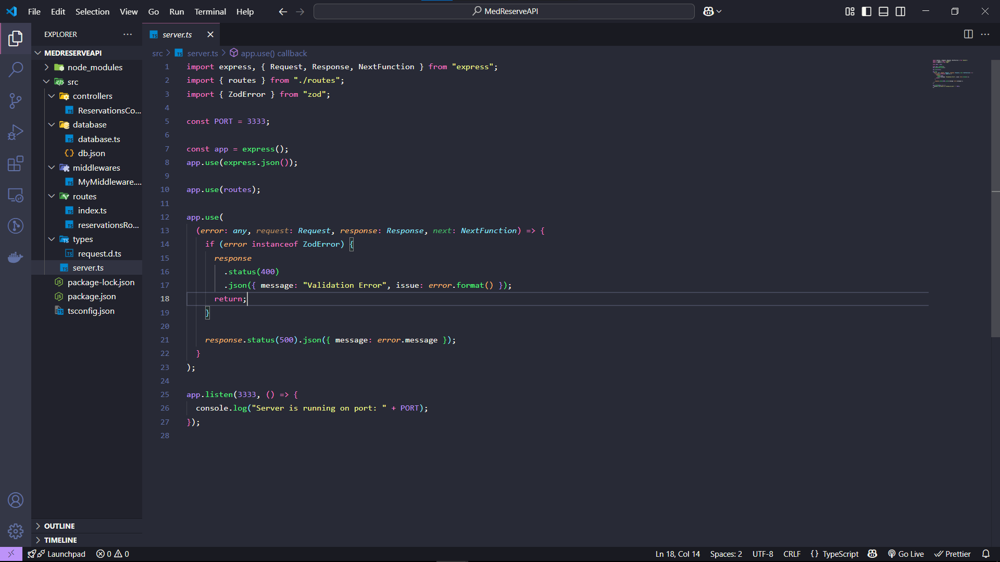

# 🚀 Projeto de API RESTful para Reserva de Serviços

Uma API robusta para o gerenciamento de agendamentos de serviços, desenvolvida com tecnologias modernas do ecossistema Node.js e baseada em boas práticas de código limpo e validação de dados.

## ✨ Tecnologias Utilizadas

- **Node.js** (v20+)
- **TypeScript** (Configuração ES2023)
- **Express** – Framework leve para criação de APIs
- **Zod** – Validação e definição de schemas com segurança de tipos
- **UUID** – Geração de identificadores únicos
- **TSX** – Execução de TypeScript no tempo de desenvolvimento
- **Insomnia** – Testes e simulação de requisições HTTP

> 

## 🔧 Funcionalidades Principais

### ✅ Validação e Segurança

- Validação rigorosa de dados com **Zod**
- Tipagem estática completa em todas as rotas e controladores
- Garantia de formatos válidos (datas, horários, nomes, etc.)

### 🔁 Operações REST

- **Criar reserva** – `POST /reservation`
- **Listar reservas** – `GET /reservation`
- **Atualizar reserva** – `PUT /reservation/:id`
- **Remover reserva** – `DELETE /reservation/:id`

### 🧠 Estrutura Modular

- Separação clara de responsabilidades:
  - Controladores
  - Rotas
  - Middleware
  - Banco de dados (arquivo JSON simulado)
